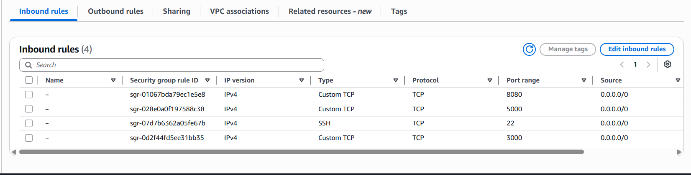
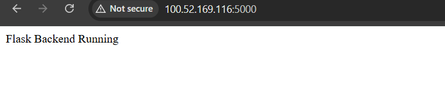
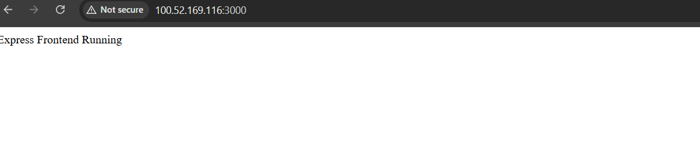

Deploy Flask & Express on EC2

Step 1:- Launch EC2 Instance

Launch Ubuntu EC2 instance:

AMI: Ubuntu 22.04
Instance Type: t2.micro
Storage: 8GB
Security Group Open Ports:
22 → SSH
3000 → Express
5000 → Flask
8080 → Jenkins

Connect to EC2
ssh -i your-key.pem ubuntu@<EC2-PUBLIC-IP>

Install Dependencies

Update Server : sudo apt update && sudo apt upgrade -y
Install Git : sudo apt install git -y
Install Python & Pip : sudo apt install python3 python3-pip python3-venv -y
Install Node.js : 
    curl -fsSL https://deb.nodesource.com/setup_20.x | sudo -E bash -
    sudo apt install nodejs -y

Install PM2 : sudo npm install -g pm2

Clone Repositories

Flask Repo

cd /opt
sudo git clone https://github.com/yourname/flask-app.git--app.py

from flask import Flask

app = Flask(__name__)

@app.route('/')
def home():
    return "Flask Backend Running"

if __name__ == "__main__":
    app.run(host="0.0.0.0", port=5000)

Express Repo

sudo git clone https://github.com/yourname/express-app.git -- server.js

const express = require("express");
const app = express();

app.get("/", (req, res) => {
  res.send("Express Frontend Running");
});

app.listen(3000, "0.0.0.0", () => {
  console.log("Server running on port 3000");
});

Setup Flask Application : cd /opt/flask-app
Create Virtual Environment
    sudo python3 -m venv venv
    sudo source venv/bin/activate

Install Requirements
    pip install -r requirements.txt

Run Flask App -> app.py

Start Flask Using PM2 --> pm2 start "venv/bin/python app.py" --name flask-app

Setup Express Application - cd /opt/express-app
Install Dependencies - Install Dependencies

Run express-app --> server.js

Start Express Using PM2 - pm2 start server.js --name express-app

Save PM2 Processes

pm2 save
pm2 startup

Verify Applications : 

    http://<EC2-IP>:5000 - Flask Backend Running

    
    http://<EC2-IP>:3000 - Express Frontend Running

    
