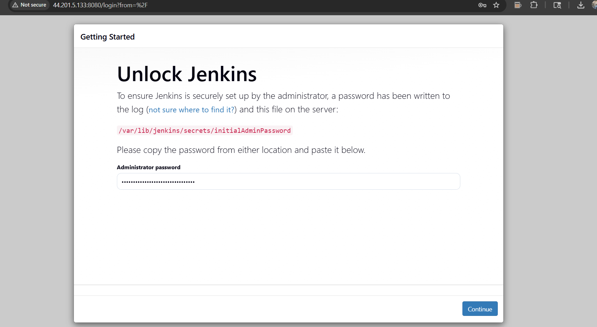
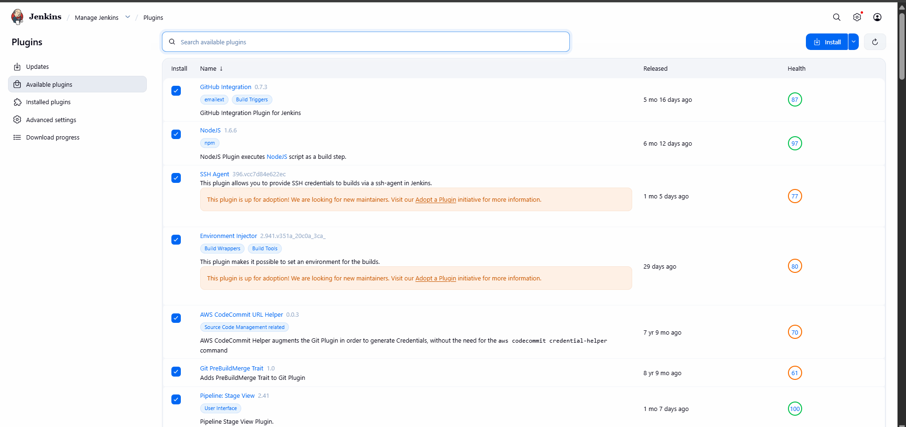
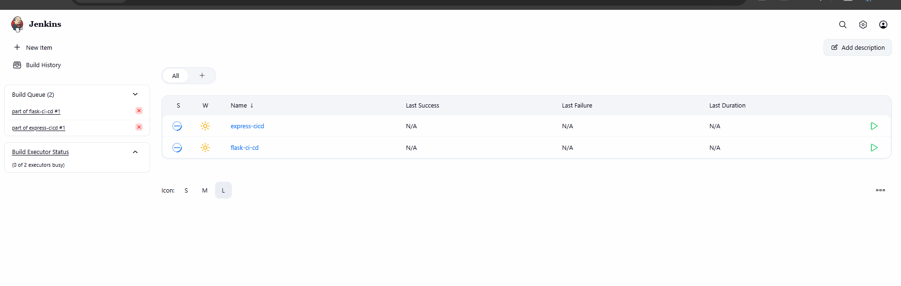
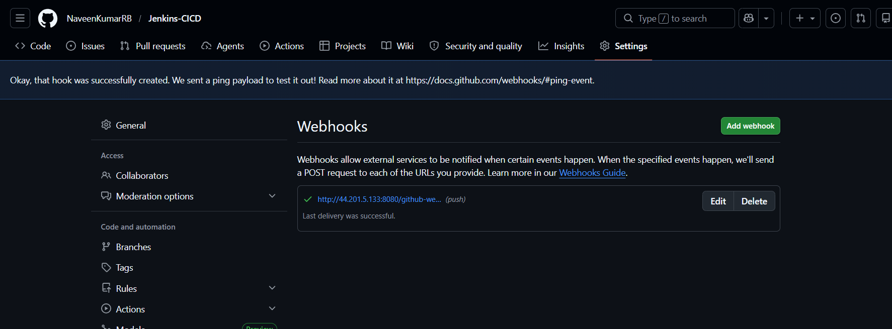

Install Jenkins

Install Java
    sudo apt install openjdk-17-jdk -y
Install Jenkins

curl -fsSL https://pkg.jenkins.io/debian-stable/jenkins.io-2023.key | sudo tee \
  /usr/share/keyrings/jenkins-keyring.asc > /dev/null

echo deb [signed-by=/usr/share/keyrings/jenkins-keyring.asc] \
  https://pkg.jenkins.io/debian-stable binary/ | sudo tee \
  /etc/apt/sources.list.d/jenkins.list > /dev/null

sudo apt update
sudo apt install jenkins -y

Start Jenkins : - 
sudo systemctl enable jenkins
sudo systemctl start jenkins

Access Jenkins - http://<EC2-IP>:8080

Get Initial Password - sudo cat /var/lib/jenkins/secrets/initialAdminPassword

Install Jenkins Plugins

Git Plugin
Pipeline Plugin
NodeJS Plugin
SSH Agent Plugin

Configure Jenkins Tools
Go to: Manage Jenkins → Global Tool Configuration
Configure:

Git
NodeJS
Python

Flask Jenkins Pipeline
Create Pipeline Job

Name: flask-ci-cd
Flask Jenkinsfile

pipeline {
    agent any

    environment {
        APP_DIR = "/opt/flask-app"
    }

    stages {

        stage('Clone Repository') {
            steps {
                git branch: 'main',
                url: 'https://github.com/yourname/flask-app.git'
            }
        }

        stage('Install Dependencies') {
            steps {
                sh '''
                cd $APP_DIR
                python3 -m venv venv
                . venv/bin/activate
                pip install -r requirements.txt
                '''
            }
        }

        stage('Restart Application') {
            steps {
                sh '''
                pm2 restart flask-app || pm2 start "venv/bin/python app.py" --name flask-app
                '''
            }
        }
    }
}

Express Jenkins Pipeline - Create Pipeline Job - express-ci-cd
Express Jenkinsfile 
    pipeline {
    agent any

    environment {
        APP_DIR = "/opt/express-app"
    }

    stages {

        stage('Clone Repository') {
            steps {
                git branch: 'main',
                url: 'https://github.com/yourname/express-app.git'
            }
        }

        stage('Install Dependencies') {
            steps {
                sh '''
                cd $APP_DIR
                npm install
                '''
            }
        }

        stage('Restart Application') {
            steps {
                sh '''
                pm2 restart express-app || pm2 start server.js --name express-app
                '''
            }
        }
    }
}

Configure GitHub Webhooks

Go to GitHub Repository: Settings → Webhooks → Add Webhook

Payload URL: http://<EC2-IP>:8080/github-webhook/
Content Type: application/json
Events: Just the push event

Environment Variables in Jenkins
Use Jenkins Credentials Manager: Manage Jenkins → Credentials
Example: 
environment {
    API_KEY = credentials('api-key-id')
}
